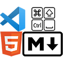

<!-- Project Shields -->

[![Contributors shield][Contributors shield url]][Contributors url]
[![Issues shield][Issues shield url]][Issues url]
[![MIT License shield][MIT License shield url]][License url]

   

# HTML & Markdown Shortcuts

## Table of Contents

   
Contents

1. [About](#about)
   1. [Built With](#built-with)
1. [Features](#features)
   1. [Change Case](#change-case)
   1. [Toggle Strikethrough](#toggle-strikethrough)
1. [Known Issues](#known-issues)
   1. [Tilde Bug](#tilde-bug)
1. [Changelog](#changelog)
1. [Acknowledgments](#acknowledgments)

## About

A VS Code extension with useful shortcuts.

   (<a href="#">back to top</a>)

### Built With

[![Typescript][Typescript shield]][Typescript url]

   (<a href="#">back to top</a>)

## Features

### Change Case

Pressing Caps Lock changes the casing of selected text.

![Change Case][Change Case animation]

### Toggle Strikethrough

Typing a tilde strikes through selected text.

![Toggle Strikethrough in HTML][Toggle Strikethrough in HTML animation]

![Toggle Strikethrough in Markdown][Toggle Strikethrough in Markdown animation]

   (<a href="#">back to top</a>)

## Roadmap

- [x] Implement change case feature [#1][#1]
- [x] Implement toggle strikethough feature [#2][#2]
- [x] Fix case change bug [#11][#11]
- [x] Add keybindings [#9][#9]
- [x] Publish the extension to Marketplace [#5][#5]
- [ ] Fix tilde bug [#19][#19]

   (<a href="#">back to top</a>)

## Changelog

See the changelog [here][changelog url].

   (<a href="#">back to top</a>)

## Contact Me

Sherpad Ndabambi

[][Personal website url]
![Gmail icon][Gmail icon url][Email address]

## License

Distributed under the MIT License. See [LICENSE][License url] for more information.

   (<a href="#">back to top</a>)

## Acknowledgments

1. [Logo][Logo url] edited from:

   1. [HTML5 badge][HTML5 badge url] by [W3C][W3C url].
   1. [Markdown mark][Markdown mark url] by Dustin Curtis from [GitHub][GitHub url].
   1. [Keyboard Command][Keyboard Command url] from [SVG Repo][SVG Repo url].
   1. [Keyboard Shift Uppercase][Keyboard Shift Uppercase url] from [SVG Repo][SVG Repo url].
   1. [Ctrl A][Ctrl A url] from [SVG Repo][SVG Repo url].
   1. [Spacebar][Spacebar url] from [SVG Repo][SVG Repo url].

1. [Website icon][Website icon url] edited from [Original website icon][Original website icon url] by
1. [Gmail icon][Gmail icon source url] by
1. Images have been compressed using [TinyPNG][TinyPNG url].
1. Parts of this README are based on the [Best-README-Template][Best-README-Template url] template.

   (<a href="#">back to top</a>)

<!-- References -->

[Best-README-Template url]: https://github.com/othneildrew/Best-README-Template
[Contributors shield url]: https://img.shields.io/github/contributors/sherpadNdabambi/html-markdown-shortcuts.svg?style=for-the-badge
[Contributors url]: https://github.com/sherpadNdabambi/html-markdown-shortcuts/graphs/contributors
[Issues shield url]: https://img.shields.io/github/issues/sherpadNdabambi/html-markdown-shortcuts.svg?style=for-the-badge
[Issues url]: https://github.com/sherpadNdabambi/html-markdown-shortcuts/issues
[MIT License shield url]: https://img.shields.io/github/license/sherpadNdabambi/html-markdown-shortcuts.svg?style=for-the-badge
[License url]: https://github.com/sherpadNdabambi/html-markdown-shortcuts/blob/main/LICENSE
[Change Case animation]: ./img/change-case.gif
[Toggle Strikethrough in HTML animation]: ./img/toggle-strikethrough-html.gif
[Toggle Strikethrough in Markdown animation]: ./img/toggle-strikethrough-markdown.gif
[#1]: https://github.com/SherpadNdabambi/html-markdown-shortcuts/issues/1
[#2]: https://github.com/SherpadNdabambi/html-markdown-shortcuts/issues/2
[#11]: https://github.com/SherpadNdabambi/html-markdown-shortcuts/issues/11
[#9]: https://github.com/SherpadNdabambi/html-markdown-shortcuts/issues/9
[#5]: https://github.com/SherpadNdabambi/html-markdown-shortcuts/issues/5
[#19]: https://github.com/SherpadNdabambi/html-markdown-shortcuts/issues/19
[changelog url]: https://github.com/SherpadNdabambi/html-markdown-shortcuts/blob/main/CHANGELOG.md
[Logo url]: https://raw.githubusercontent.com/SherpadNdabambi/html-markdown-shortcuts/main/img/html-markdown-shortcuts-logo.png
[HTML5 badge url]: https://upload.wikimedia.org/wikipedia/commons/6/61/HTML5_logo_and_wordmark.svg
[W3C url]: https://www.w3.org/html/logo/index.html
[Markdown mark url]: https://upload.wikimedia.org/wikipedia/commons/4/48/Markdown-mark.svg
[GitHub url]: https://github.com/dcurtis/markdown-mark/tree/master/svg
[Keyboard Command url]: https://www.svgrepo.com/svg/513785/keyboard-command
[Keyboard Shift Uppercase url]: https://www.svgrepo.com/svg/309713/keyboard-shift-uppercase
[SVG Repo url]: https://www.svgrepo.com/
[Ctrl A url]: https://www.svgrepo.com/svg/371190/ctrl-a
[Spacebar url]: https://www.svgrepo.com/svg/311219/spacebar
[Email address]: mailto:sgndabambi@gmail.com
[Personal website url]: http://sherpadndabambi.github.io/

[Typescript shield]:
[Typescript url]:
[Gmail icon url]:
