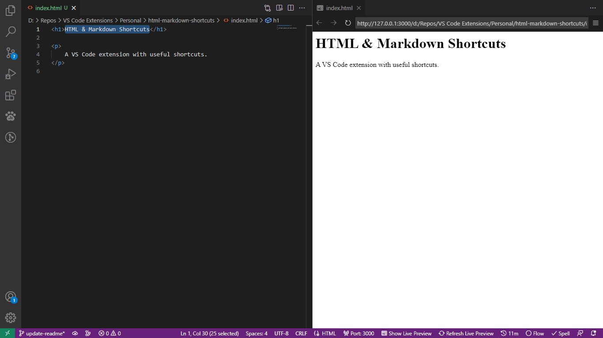
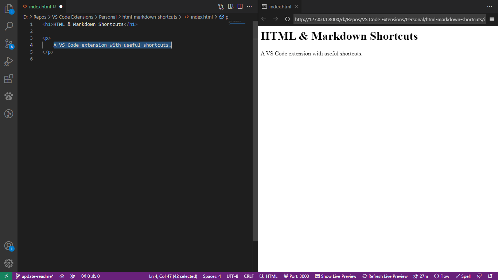
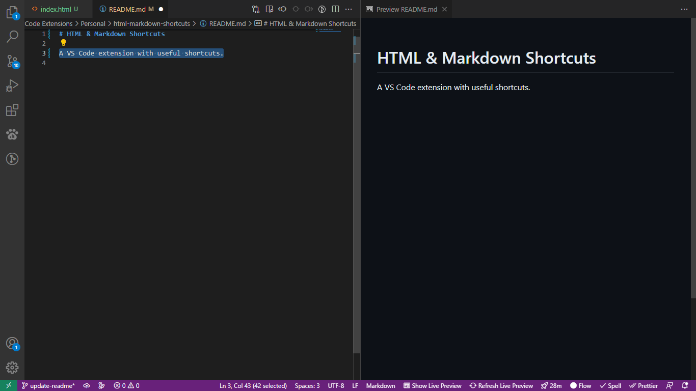

# HTML & Markdown Shortcuts

## Table of Contents

   
Contents

1. [About](#about)
1. [Features](#features)
   1. [Change Case](#change-case)
   1. [Toggle Strikethrough](#toggle-strikethrough)
1. [Changelog](#change-case)
1. [Attributions](#attributions)

## About

A VS Code extension with useful shortcuts.

## Features

### Change Case

Pressing Caps Lock changes the casing of selected text.

### Toggle Strikethrough

Typing a tilde strikes through selected text.

## Changelog

See the changelog [here](https://github.com/SherpadNdabambi/html-markdown-shortcuts/blob/main/CHANGELOG.md).

## Attributions

1. [Logo](https://raw.githubusercontent.com/SherpadNdabambi/html-markdown-shortcuts/main/img/html-markdown-shortcuts-logo.png) edited from:

   1. [HTML5 badge](https://upload.wikimedia.org/wikipedia/commons/6/61/HTML5_logo_and_wordmark.svg) by [W3C](https://www.w3.org/html/logo/index.html).
   1. [Markdown mark](https://upload.wikimedia.org/wikipedia/commons/4/48/Markdown-mark.svg) by Dustin Curtis from [GitHub](https://github.com/dcurtis/markdown-mark/tree/master/svg).
   1. [Keyboard Command](https://www.svgrepo.com/svg/513785/keyboard-command) from [SVG Repo](https://www.svgrepo.com/).
   1. [Keyboard Shift Uppercase](https://www.svgrepo.com/svg/309713/keyboard-shift-uppercase) from [SVG Repo](https://www.svgrepo.com/).
   1. [Ctrl A](https://www.svgrepo.com/svg/371190/ctrl-a) from [SVG Repo](https://www.svgrepo.com/).
   1. [Spacebar](https://www.svgrepo.com/svg/311219/spacebar) from [SVG Repo](https://www.svgrepo.com/).

1. Images have been compressed using [TinyPNG](https://tinypng.com/).
